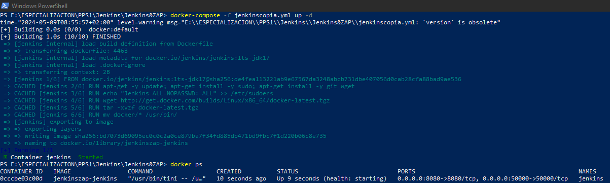
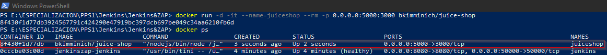
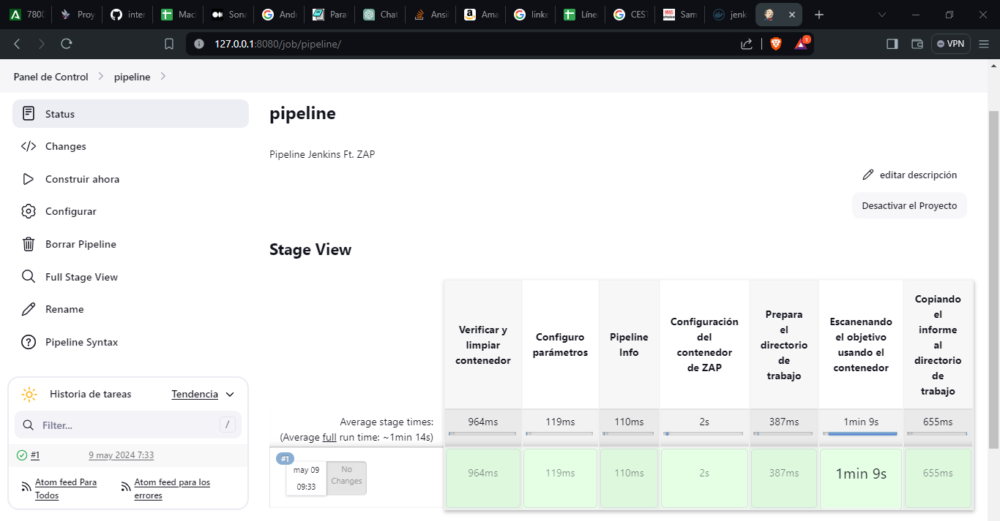
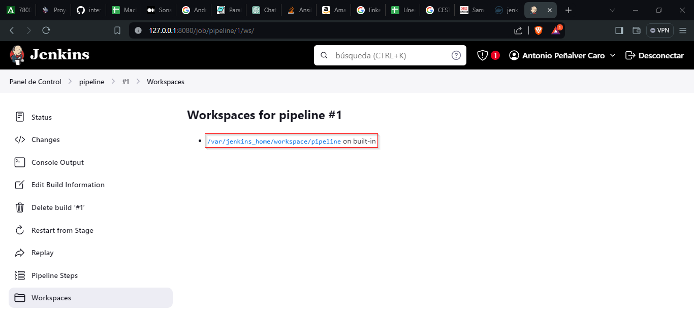
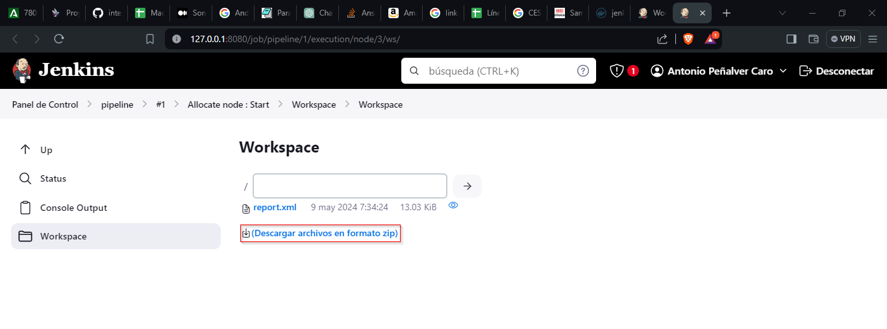
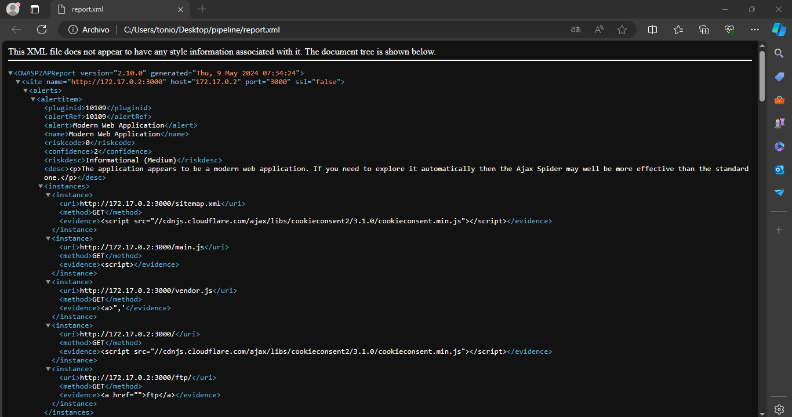

# Índice

- [Jenkins Ft. OWASP ZAP](#jenkins-ft-owasp-zap)
    - [Desplegando Jenkins](#desplegando-jenkins)
    - [OWASP ZAP](#owasp-zap)
    - [Desplegando Juice Shop](#desplegando-juice-shop)
    - [Pipeline Jenkins](#pipeline-jenkins)
    - [Lanzamiento del pipeline](#lanzamiento-del-pipeline)
    - [Comprobación de resultados](#comprobación-de-resultados)

# Jenkins Ft. OWASP ZAP

Lo primero que haremos, será descargarnos los contenedores necesarios para poder hacer el ejercicio:

- Jenkins
- OWASP ZAP
- Juice Shop (Aplicación vulnerable)

## Desplegando Jenkins



## OWASP ZAP

El contenedor de ZAP se desplegará automáticamente cuando lancemos el pipeline que configuraremos más tarde.

## Desplegando Juice Shop

)

## Pipeline Jenkins

A continuación, crearemos un nuevo pipeline en Jenkins que haga lo siguiente:

### 1. Verificar y limpiar contenedor

Un 'stage' que verifique si el contenedor de OWASP ZAP está activo y, de ser así, lo detiene y elimina para asegurar que no existan conflictos o estados residuales antes de iniciar un nuevo escaneo.

### 2. Configurar parámetros

Defina parámetros que se usarán a lo largo del pipeline. Los parámetros incluyen:

- SCAN_TYPE: El tipo de escaneo que se realizará (Baselines, APIS, Full).
- TARGET: La dirección IP del objetivo del escaneo.
- GENERATE_REPORT: Un booleano para decidir si se generará un reporte.
- REPORT_PATH: La ruta donde se guardará el informe generado.

### 3. Imprimir Info

Un 'stage' que simplemente imprima los parámetros utilizados en la ejecución actual del pipeline, proporcionando una referencia rápida a los valores configurados.

### 4. Configurar un contenedor de OWASP ZAP

Un 'stage' que se descargue la última versión de la imagen Docker de OWASP ZAP y lo inicie bajo el nombre "owasp". Este contenedor será el encargado de realizar los escaneos.

### 5. Preparar el directorio de trabajo

Una vez que el contenedor esté en marcha, el siguiente 'stage' que creará un directorio de trabajo dentro de dicho contenedor (/zap/wrk). Este directorio será utilizado para almacenar los resultados del escaneo y cualquier otro dato temporal necesario durante el proceso.

### 6. Escanear el objetivo

Dependiendo del tipo de escaneo seleccionado (SCAN_TYPE), se ejecutarán diferentes scripts proporcionados por ZAP para realizar escaneos de línea base o escaneos completos sobre el objetivo especificado (TARGET).

### 7. Copiar el informe al WorkSpace de Jenkins

Finalmente, si se generó un informe durante el escaneo, el último 'stage' copiará el informe desde el contenedor Docker al WorkSpace de Jenkins, asegurando que los resultados estén disponibles para ser revisados o almacenados de manera persistente fuera del contenedor.

#### Pipeline

```groovy
pipeline {
    agent any
    stages {
        stage('Verificar y limpiar contenedor') {
            steps {
                script {
                    // Comando para verificar si el contenedor está corriendo y detenerlo
                    sh """
                        if [ \$(docker ps -q -f name=^owasp\$) ]; then
                            echo "El contenedor 'owasp' está corriendo. Deteniéndolo y eliminándolo..."
                            docker stop owasp
                            docker rm owasp
                        elif [ \$(docker ps -aq -f name=^owasp\$) ]; then
                            echo "El contenedor 'owasp' existe pero no está corriendo. Eliminándolo..."
                            docker rm owasp
                        else
                            echo "El contenedor 'owasp' no existe."
                        fi
                    """
                }
            }
        }
        stage('Configuro parámetros') {
            steps {
                script { 
                    properties([
                        parameters([
                            choice (
                                choices: ["Baselines", "APIS", "Full"],
                                description: "Tipo de escaneo",
                                name: "SCAN_TYPE"
                            ),
                            string (
                                defaultValue: "http://172.17.0.2:3000/",
                                description: "Objetivo del escaneo",
                                name: "TARGET"
                            ),
                            booleanParam(
                                defaultValue: true, 
                                description: 'Genera reporte', 
                                name: 'GENERATE_REPORT'
                            ),
                            string (
                                defaultValue: "/tmp/reports/reportZAP",
                                description: "Ruta para guardar el informe",
                                name: "REPORT_PATH"
                            )
                        ])
                    ])
                }
            }
        }
        stage("Pipeline Info") {
            steps {
                script {
                    echo """
                    Parametros usados:
                        Tipo: \${params.SCAN_TYPE}
                        Objetivo: \${params.TARGET}
                        Informe: \${params.GENERATE_REPORT}
                    """
                }
            }
        }
        stage("Configuración del contenedor de ZAP") {
            steps {
                script {
                    echo "Pulling de la imagen de ZAP"
                    sh """
                        docker pull pixylweb/zap2docker-stable
                    """
                    echo "Arrancando el contenedor --> Start"
                    sh """
                        docker run -dt --name=owasp pixylweb/zap2docker-stable /bin/bash
                    """
                }
            }
        }
        stage("Prepara el directorio de trabajo") {
            steps {
                script {
                    sh """
                        docker exec owasp mkdir /zap/wrk
                    """
                }
            }
        }
        stage("Escaneando el objetivo usando el contenedor") {
            steps {
                script {
                    scan_type="\${p
```

## Lanzamiento del pipeline

)

Como se observa en la imagen anterior, el pipeline que creamos anteriormente, se ha lanzado con éxito.

## Comprobación de resultados

A continuación, nos iremos al WorkSpace de Jenkins y accederemos al enlace que nos viene.

)

Nos descargamos el "zip" que contiene el resultado del escaneo.

)

Visualizamos los resultados en el navegador.

)


